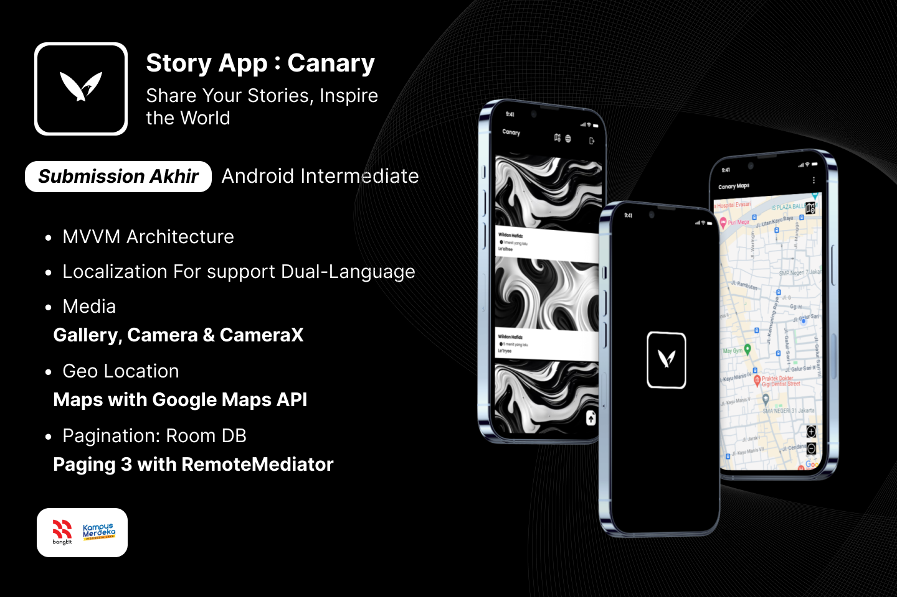

## Canary App 

I'm pleased to announce that I have completed the Belajar Pengembangan Aplikasi Android Intermediate certification from Dicoding Indonesia! 🚀📱

This course, part of my journey with Bangkit Academy led by Google, Tokopedia, Gojek, & Traveloka covered advanced topics in Android development, including advanced UI, animation, localization and accessibility, services, media, geo-location, advanced testing, advanced database, and Firebase. For my final project, I developed a story app with photo-sharing capabilities and Paging implementation, meeting all the criteria set by Google and achieving a high score and I was inspired to create the Canary logo design by my father's canary bird.

## Features

- MVVM Architecture: This robust architecture ensures a clean and maintainable codebase, facilitating easy development and future enhancements.

- Localization for Dual-Language Support: The app caters to a global audience by supporting multiple languages, enabling users to seamlessly share stories in their preferred language.

- Rich Media Integration: Users can seamlessly incorporate various media formats, including images, videos, and audio, into their stories, enhancing the storytelling experience.

- Geolocation Functionality: Leveraging Google Maps API, the app integrates maps, allowing users to share stories based on their location, adding a contextual dimension to their narratives.

- Efficient Pagination: The app employs Room Database and Paging 3 with Remote Mediator to ensure efficient data handling and smooth loading of stories, even when dealing with large amounts of content.

## Summary

Canary emerges as a comprehensive story-sharing platform, equipped with advanced features that empower users to create, share, and discover compelling stories from around the world. The app's robust architecture, multilingual support, rich media integration, geolocation functionality, and efficient pagination make it an ideal tool for storytellers and content consumers alike.
